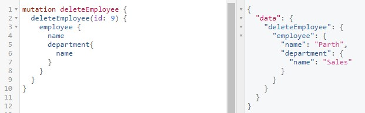

# WEC NITK GSDC Task ID: CRUD API

A Django based CRUD API to manage employees in an organization.  
It uses <b>GraphQL</b> to communicate between the frontend and the backend. 

 

<h2> Screenshots </h2>
<h4>Query - All Employees </h4>

 

<h4>Query - Get Single Employee</h4>

 

<h4>Query - All Department Employees</h4>

 

<h4>Mutation - Create Employee</h4>

 

<h4>Mutation - Update Employee</h4>

 

<h4>Mutation - Delete Employee</h4>

 

 

<h2>Setting up the project:</h2>
 
<h3>Installing and using a Virtual Environment</h3>

`pip install virtualenvwrapper-win` 
`mkvirtualenv test` &nbsp; _test = name of virtual env_

 

<h3>Install required packages:</h3>

`pip install -r requirements.txt` 

 
<h3>To run project:</h3>

_After ensuring that we are in a virtual environment (If not, use `workon test`)_

`python manage.py makemigrations`  
`python manage.py migrate`  
`python manage.py runserver` 

Visit development server http://127.0.0.1:8000/graphql 

 Admin at http://127.0.0.1:8000/admin 

 
<h2>References:</h2>
<a href="https://docs.djangoproject.com/en/3.2/">Django's Official Documentation</a> 
<a href="https://docs.graphene-python.org/en/latest/">Python Graphene Documentation</a> 
Articles - <a href ="https://programmingwithmosh.com/backend/graphql/using-graphql-in-your-python-django-application/"> 1, </a>
<a href="https://medium.com/analytics-vidhya/graphql-with-django-simple-yet-powerful-crud-part-2-bacce3668e35">2,</a> 
<a href="https://www.fullstacklabs.co/blog/django-graphene-rest-graphql">3,</a>
<a href="https://stackabuse.com/building-a-graphql-api-with-django/">4</a>
and <a href="https://www.youtube.com/playlist?list=PLOLrQ9Pn6caxz00JcLeOR-Rtq0Yi01oBH">Tutorials</a>